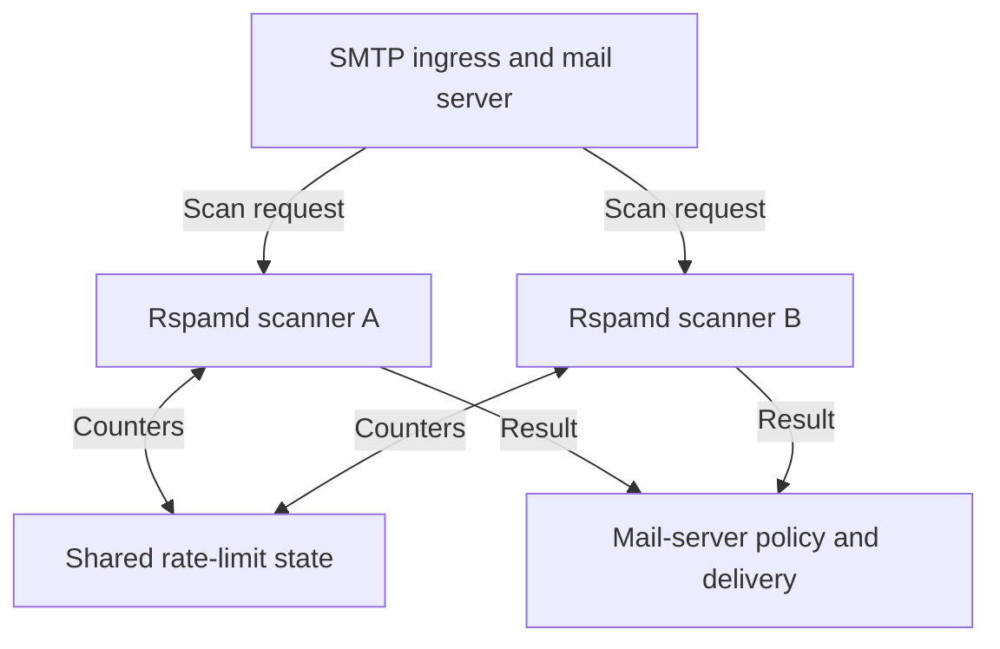

# Handling an Inbound Mail Flood
## Scaling Rspamd and applying sender/IP rate limits

An incoming mail attack put pressure on an email platform I operated. I mitigated it by scaling the incoming Rspamd scanners horizontally and enabling incoming rate limits by sender and IP.

Those two changes addressed different parts of the problem. Additional scanners increased processing capacity. Rate limits controlled how much traffic individual sources could contribute. The objective was to keep legitimate mail moving while containing the flood.

This article describes that operational approach and the reasoning behind it. The implementation details remain private; the topology below is illustrative. The operational checks are guidance for applying the approach, rather than a reconstruction of every step taken during the incident.

**Companion post:** [From SMTP Errors to Abuse Response: Building Email Security Automation](https://github.com/mohammad-hachem/email-abuse-response-automation).

## Why I combined scaling with rate limits

Adding scanners can relieve pressure when message inspection is the bottleneck. It also gives unwanted traffic more processing capacity unless an admission policy controls it.

Tightening limits can reduce pressure, but a limit that is too broad can affect unrelated senders. An incoming connection may belong to a large mail provider or relay serving many legitimate users.

I added incoming Rspamd capacity and enabled sender- and IP-based rate limits. Together, those changes addressed two questions:

- Can the platform process the traffic it should accept?
- Can one source consume a disproportionate share of that capacity?

Neither question can be answered by scanner CPU usage alone.

## Where the scanners fit

The diagram shows an example arrangement, not the original production topology:

Rspamd processes messages and returns results to its integration with the mail server. Adding a scanner does not automatically redistribute requests: the configured integration must actually send work to it. The supported worker arrangements are described in the [Rspamd architecture documentation](https://docs.rspamd.com/developers/architecture/).

For a deployment following this pattern, check that new scanners receive traffic, use the intended policy, and have the dependencies needed to make equivalent decisions.

A healthy process that receives no requests adds no effective capacity. A scanner with a different policy introduces inconsistent treatment.

## Scaling the right part of the mail path

Before expanding a scanner pool, identify where work is accumulating. Useful signals include:

| Signal | Question it helps answer |
|---|---|
| Incoming connection and message rates | Is the offered workload increasing, and at which stage? |
| Scan duration and scanner timeouts | Is inspection becoming slower or unavailable? |
| Per-scanner requests, CPU, and memory | Is work distributed, and are workers saturated? |
| Mail queue depth and oldest message age | Is delivery recovering, or is old mail still waiting? |
| DNS, Redis, and other dependency latency | Would more scanners overload a shared dependency? |
| Downstream delivery errors | Is the bottleneck after scanning? |

Compare these signals before and after each capacity change. More scanner instances are useful only if the rest of the path can support them.

Horizontal scaling also needs an operational exit path: stop assigning new requests to an unhealthy scanner, allow outstanding work to finish where possible, and observe the remaining pool. Test the integration's timeout and failure behavior before relying on it during an incident.

There is a boundary to this approach. If network bandwidth or SMTP connection handling is exhausted before a message reaches inspection, adding Rspamd workers cannot recover that upstream capacity. Edge or upstream controls may be needed separately.

## Why use both sender and IP limits?

A sender-based limit and an IP-based limit describe different things.

| Dimension | What it can constrain | What needs care |
|---|---|---|
| Sender | Concentrated activity associated with the selected sender value | Sender fields may be forged or changed; define exactly which field is used. |
| Source IP | Aggregate activity coming through one network source | A shared provider or relay can represent many legitimate senders. |
| Sender/IP combination | Activity for a specific pair | Changing either value can distribute traffic across more buckets. |

The exact sender field used in the incident is intentionally not published. For a new implementation, decide whether “sender” means the SMTP envelope sender, a header value, or another validated identity. Do not treat the visible From address as authenticated ownership.

Likewise, verify that the IP supplied to the scanner is the intended remote source. A trusted relay or proxy can otherwise cause unrelated traffic to appear under one address. Do not accept arbitrary client-supplied forwarding metadata as trusted identity.

These controls should also account for legitimate bounces with an empty envelope sender. A missing sender value is not, by itself, proof of abuse.

Sender/IP limits constrain concentrated traffic; they do not impose an overall platform capacity ceiling. A flood spread across many identities can still overwhelm the service.

## Keep rate limits consistent as the scanner pool grows

For the standard Rspamd ratelimit module, Redis holds bucket state that can be shared across scanners. Its token-bucket model distinguishes sustained rate from permitted bursts. It supports sender/IP-based keys and combinations. Depending on configuration, exceeding a limit can produce a soft-reject result or a symbol for subsequent policy handling. Consult the [ratelimit module documentation](https://docs.rspamd.com/modules/ratelimit/) for the installed version.

That is a reference implementation option, not a disclosure of the incident's private configuration.

A practical design check is whether a limit applies to the whole scanner pool or independently on each scanner. With independent counters, distributing the same source across more scanners can increase its effective allowance.

For shared counters, verify consistent key construction and the intended shared state. Also define what happens if that state becomes unavailable. Do not discover the service's failure behavior during an attack.

## Rate limiting must translate into the intended mail-server action

A detection or limit result is useful only when the mail integration applies it correctly.

For a synchronous SMTP integration, a temporary failure response can ask the sending system to retry later. That creates delay; it does not guarantee eventual delivery. Senders have retry limits, and persistent deferral can eventually result in failure. Permanent rejection has different consequences and should be a deliberate policy decision.

The timing matters too. Once a mail server has accepted responsibility for a message, it cannot retroactively defer the original SMTP transaction. An after-queue design needs its own queue and failure handling.

For a new deployment, trace a controlled message through the entire path: source, scan result, SMTP response or queue action, and final disposition. Do not infer the outcome solely from a Rspamd log entry.

## Protect legitimate delivery while containing the flood

The difficult part is choosing controls that reduce abusive load without treating every burst as malicious.

When applying this approach:

- Establish normal burst patterns before choosing thresholds.
- Review shared mail providers and relays before applying broad IP restrictions.
- Keep exceptions narrowly scoped and give each one an owner and review date.
- Preserve other inspection controls when granting a rate-limit exception.
- Track delayed legitimate mail alongside the volume being limited.

No universal threshold is published here. Appropriate rates depend on traffic mix, message size, recipient behavior, shared infrastructure, and the platform's processing capacity. Copying another operator's number would hide those decisions.

## The outcome and recovery checks

I mitigated the incoming attack by expanding the Rspamd scanner pool and enabling incoming rate limits by sender and IP.

For someone applying the approach, recovery should be demonstrated through several observations:

1. Scanner latency and timeout rates stabilize.
2. The oldest queued messages progress, and the backlog trends toward normal.
3. Controlled legitimate messages complete the real delivery path.
4. High-volume sources receive the intended policy outcome.
5. Shared dependencies and downstream delivery remain healthy.
6. The platform remains stable when a scanner is removed from service.

A lower CPU graph can mean successful load control, but it can also mean requests are failing before reaching the scanners. Delivery evidence is what distinguishes those situations.

After the incident, review temporary restrictions and exceptions, update the capacity baseline, and preserve a clear record of the decisions. Keep message content and identifying infrastructure details out of public incident material.

## How this differs from outbound abuse automation

I also implemented a separate outbound-abuse workflow connected to the distributed Rspamd platform. Elasticsearch rules and alerts identified suspicious behavior from sending volume and repeated failures, and scripts applied restrictions through Rspamd and the mail-account system.

That workflow addressed abusive sending and IP reputation. The inbound response described here addressed incoming load and delivery continuity. Keeping those objectives separate makes the enforcement decisions easier to explain and review.

Read the outbound case study: **[From SMTP Errors to Abuse Response](https://github.com/mohammad-hachem/email-abuse-response-automation)**. It covers the detection rules, automatic restrictions, legitimate bulk-mail exceptions, and manual recovery process.

## What I took from this incident

I used two controls together: more incoming Rspamd scanners and rate limits by sender and IP. The response addressed processing capacity and the traffic contributing to the load. That combination mitigated the attack.

For another operator applying this approach, these are the checks to keep in front of you:

- Locate the bottleneck before adding capacity; scanning is only one part of mail delivery.
- Check that adding scanners does not multiply a source's effective rate allowance.
- Define “sender” and “source IP” precisely before building rules around them.
- Verify what the mail server actually does with a rate-limit result.
- Keep legitimate delivery and queue age visible throughout the response.
